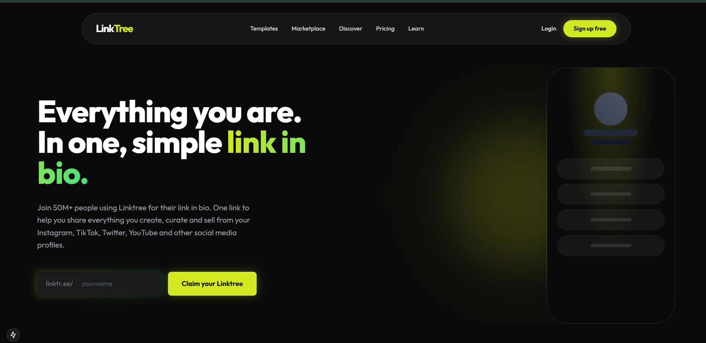

# 🌲 LinkTree Clone



> **Everything you are. In one, simple link in bio.**
> A premium, high-performance Linktree clone built with Next.js 14 and MongoDB.

[](https://nextjs.org/)
[](https://tailwindcss.com/)
[](https://www.mongodb.com/)
[](https://opensource.org/licenses/MIT)

## ✨ Features

- **🎨 Modern Aesthetic**: "Dark Cyber" theme with fluid mesh gradients and glassmorphism.
- **⚡ Super Fast**: Built on Next.js App Router for optimal performance.
- **📱 Fully Responsive**: Flawless experience on mobile, tablet, and desktop.
- **🔗 Link Management**: Create, edit, and manage your links via a dashboard.
- **🌍 Dynamic Profiles**: Claim your unique handle (e.g., `localhost:3000/yourname`).
- **🔍 Discover**: Browse and search for other creators in the community.
- **🛡️ Secure**: MongoDB backend for reliable data persistence.

## 🚀 Getting Started

### Prerequisites

- Node.js 18+
- MongoDB Database URI

### Installation

1.  **Clone the repository**
    ```bash
    git clone https://github.com/amitkumarpatra99/LinkeTreeClone.git
    cd LinkeTreeClone
    ```

2.  **Install dependencies**
    ```bash
    npm install
    ```

3.  **Environment Setup**
    Create a `.env.local` file in the root directory and add your MongoDB URI:
    ```env
    MONGODB_URI=your_mongodb_ur_here
    ```

4.  **Run the application**
    ```bash
    npm run dev
    ```

    Open [http://localhost:3000](http://localhost:3000) to view it in the browser.

## 📂 Project Structure

```
├── app/
│   ├── api/            # API Routes (Users, Add, etc.)
│   │   ├── add/        # Add Link/User Route
│   │   └── users/      # Fetch Users Route
│   ├── [handle]/       # Dynamic Profile Pages
│   ├── discover/       # Discover Page
│   ├── generate/       # Dashboard & Link Creation
│   ├── login/          # Login UI
│   ├── globals.css     # Global Styles (Tailwind + Custom)
│   ├── layout.tsx      # Root Layout
│   └── page.tsx        # Landing Page
├── components/         # Reusable Components (Navbar, Footer)
├── lib/                # Library code (MongoDB client)
└── public/             # Static Assets
```

## 🛠️ Tech Stack

- **Framework**: [Next.js 14](https://nextjs.org/)
- **Styling**: [Tailwind CSS](https://tailwindcss.com/)
- **Database**: [MongoDB](https://www.mongodb.com/)
- **Font**: [Outfit](https://fonts.google.com/specimen/Outfit)
- **Deployment**: Vercel (Recommended)

## 🔌 API Endpoints

### 1. Add/Update User & Links
- **URL**: `/api/add`
- **Method**: `POST`
- **Description**: Creates a new user profile or updates an existing one with links.
- **Body**:
  ```json
  {
    "handle": "yourname",
    "pic": "url_to_image",
    "links": [
      { "link": "https://github.com", "linktext": "GitHub" }
    ]
  }
  ```

### 2. Fetch All Users
- **URL**: `/api/users`
- **Method**: `GET`
- **Description**: Retrieves a list of all registered users (limited to 50).
- **Response**:
  ```json
  {
    "success": true,
    "users": [...]
  }
  ```

## 🤝 Contributing

Contributions are always welcome!

1.  Fork the Project
2.  Create your Feature Branch (`git checkout -b feature/AmazingFeature`)
3.  Commit your Changes (`git commit -m 'Add some AmazingFeature'`)
4.  Push to the Branch (`git push origin feature/AmazingFeature`)
5.  Open a Pull Request

## 📄 License

Distributed under the MIT License. See `LICENSE` for more information.

---

<p align="center">
  Built with ❤️ by MR PATRA
</p>
